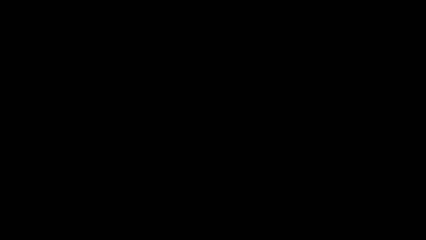
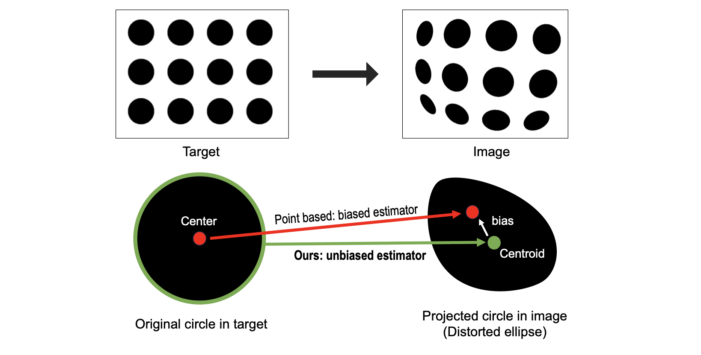
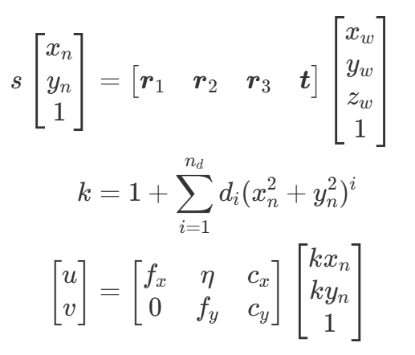
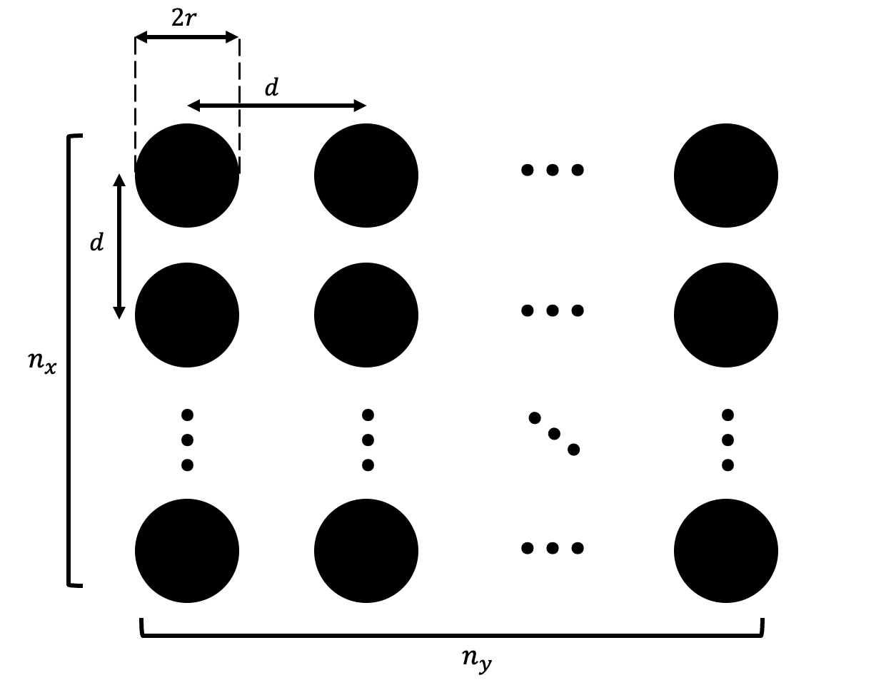

# Welcome to Discocal! (CVPR24, ***highlight***)
Paper title: Unbiased Estimator for Distorted Conics in Camera Calibration 

For decades, the checkerboard pattern has been the go-to method for camera calibration, providing only pixel-level precision. But what if we could improve accuracy even further? This paper reveals the power of the circular pattern: a game-changer offering subpixel precision to meet challenges even from unconventional visual sensors.


[[Paper]](https://arxiv.org/abs/2403.04583)[[Video]](http://www.youtube.com/watch?v=87_R7Qkpczo)[[Demo]](http://www.youtube.com/watch?v=j86pyBZe7t0)[[OpenCV Webinar]](https://www.youtube.com/live/MTMMoN6ogcY?si=22DAdrzM3p9kDQK4)[[BibTex]](#bibtex)



## Discocal is actively maintained!

- **A new version has been released (more accuarte and robust).**
- If you encounter any bugs or problem, feel free to open an issue!
- For the previous stable version, please refer to the v1 branch.

## News
<!-- :round_pushpin: :Patch notes,    :tada:: awards -->
- 24.04.10. :round_pushpin: (Early access) New version is released. It is more accurate and robost.
- 24.07.19. :tada: This work is invited to [OpenCV Webinar](https://www.youtube.com/live/MTMMoN6ogcY?si=22DAdrzM3p9kDQK4)
- 24.06.17. :round_pushpin:Add a description of how to undisort images using our method.
- 24.04.17. :round_pushpin:We update circular pattern detector! Now, you don't need to tune hyperparameters for detections
- 24.04.05. :tada: Discocal is selected for highlight poster. (11.9% of accepted papers, 2.8% of total submissions.)

## Why discocal? :The previous limitation in camera calibration

Sub-pixel accuracy and detection robustness are virtues of the conic features. But why do we use a checkerboard, not a circular pattern?

> :cry: Conic is ***not*** conic anymore under distortion!!

As shown below, the circle center is not projected to the centroid of the distorted ellipse under perspective transformation and distortion.



Without considering geometery of the distorted ellipse, existing circular pattern-based calibration methods are biased, which leads low calibration accuracy than a checkerboard pattern.

> :pushpin: **Our unbiased estimator completes the missing piece in the conic-based calibration pipeline**


------------------
# How to use
## 0. Check the camera model

We assume **pinhole camera model** with **radial distortion**.
<!-- <p align="center">
  
</p> -->
```math
\begin{aligned}
s\begin{bmatrix}
x_n\\ y_n \\ 1
\end{bmatrix} &= \begin{bmatrix} \boldsymbol{r}_1 & \boldsymbol{r}_2 & \boldsymbol{r}_3 & \boldsymbol{t} 
\end{bmatrix}\begin{bmatrix}
x_w\\ y_w \\ z_w \\ 1
\end{bmatrix} \\
k &= 1+ \sum_{i=1}^{n_d}d_i(x_n^2+y_n^2)^i\\
\begin{bmatrix}
u\\ v
\end{bmatrix} &= \begin{bmatrix}
f_x & \eta & c_x \\
0 & f_y & c_y
\end{bmatrix} \begin{bmatrix}
kx_n \\ ky_n \\ 1
\end{bmatrix}
\end{aligned} 
```
Calibration results: $f_x, f_y, c_x, c_y, \eta, d_1, d_2, ... d_n$

### Q. How do you undisort images using this model?
#### Option 1) Use cv::undistort function(Only n_d <=3)
Our model is compatible to OpenCV pin-hole camera model. **Set p1 and p2 as zero**.

```
distcoeff=(cv::Mat1d(1, 5) << d_1, d_2, 0., 0., d_3);
cv::initUndistortRectifyMap(camera_matrix, distcoeff, cv::Mat(), camera_matrix, imageSize, CV_32FC1, mapx, mapy);
cv::remap(image,undist_image, mapx, mapy, cv::INTER_LINEAR);
```
#### Option 2) Use Imagehandler class (General case)
We provide a class that has an "undistort" function. This class can deal with n_d>3 cases. Please refer to the “CImagehander.cpp” files for details.
```
Imagehandler imagehandler(width, height, total_params, n_d);
cv::Mat undist_image = imagehandler.undist(image);
```

## 1. Prepare a calibration target


Our method needs a planer white board on which black circle grid patterns are printed. 
You can easily design these patterns in this [site](https://calib.io/pages/camera-calibration-pattern-generator).

**Previous methods prefer to reduce the size of the circles to minimize bias, but our method is not limited to this. In fact, the larger the circles, the more accurate the measurements.**

> **Q. How to decide the number of cicles and the radius size?** 
The larger the radius of the circle, the more accurate the observations become. The greater the number of circles, the more observations you have, leading to increased robustness. Since these two values are in a trade-off relationship within a limited area, adjust them appropriately. It is recommended that every circle contains more than 400 pixels in images and not to exceed 7x5 circles.

## 2. Clone the repository
```bash
git clone --recursive https://github.com/chaehyeonsong/discocal_dev.git
```
The recursive option is needed for pybind
## 3. Install dependency
### Option 1) Install bellow packages
- [Ceres-Solver](http://ceres-solver.org/index.html)
- [Eigen3](https://eigen.tuxfamily.org/dox/index.html)
- opencv4

### Option 2) Use docker
(Recommended) Build a docker image using the dockerfile.
```bash
docker build -t chaehyeonsong/discocal .  -f dockerfile
```
For visualization
```bash
xhost +local:docker
```
Run container (mount your discoal path to /mnt in docker container)
```bash
docker run -it -v /tmp/.X11-unix:/tmp/.X11-unix -e DISPLAY=unix$DISPLAY -v [your repository path]:/mnt chaehyeonsong/discocal
[In docker container]$ cd /mnt
```

## 4. Revise config files
You should change calibration options using yaml files in the config folder.

Refer to the config_example folder (mono.yaml is an example for intrinsic calibration and stereo.yaml is for extrinsic calibration)

## 5. Bulid and Run
	## Build
	cd [discocal folder]
	mkdir build
	cd build
	cmake ..
	make

	## Run (chose one of out files)
	./mono.out [config path]
	./stereo.out [config path]


## Application: Thermal Camera calibration (Extreme case)

We can leverage the detection robustness of the circular patterns, particularly for unconventional cameras, such as thermal cameras. What the demo video!

[](https://youtu.be/j86pyBZe7t0)

## BibTex
```
@INPROCEEDINGS{chsong-2024-cvpr,  
    author    = {Song, Chaehyeon and Shin, Jaeho and Jeon, Myung-Hwan and Lim, Jongwoo and Kim, Ayoung},
    title     = {Unbiased Estimator for Distorted Conics in Camera Calibration},
    booktitle = {IEEE/CVF Conference on Computer Vision and Pattern Recognition (CVPR)},
    month     = {June},
    year      = {2024},
    pages     = {373-381}
}
```
## Lisence
 <a rel="license" href="http://creativecommons.org/licenses/by-nc-sa/4.0/"></a><br />This work is licensed under a <a rel="license" href="http://creativecommons.org/licenses/by-nc-sa/4.0/">Creative Commons Attribution-NonCommercial-ShareAlike 4.0 International License</a>.

- This work is protected by a patent.
- All codes on this page are copyrighted by Seoul National University published under the Creative Commons Attribution-NonCommercial-ShareAlike 4.0 License. You must attribute the work in the manner specified by the author. You may not use the work for commercial purposes, and you may only distribute the resulting work under the same license if you alter, transform, or create the work.
- For commercial purposes, please contact to <a href="mailto:chaehyeon@snu.ac.kr">chaehyeon@snu.ac.kr</a>
