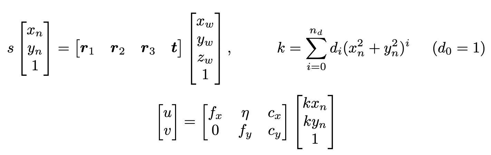
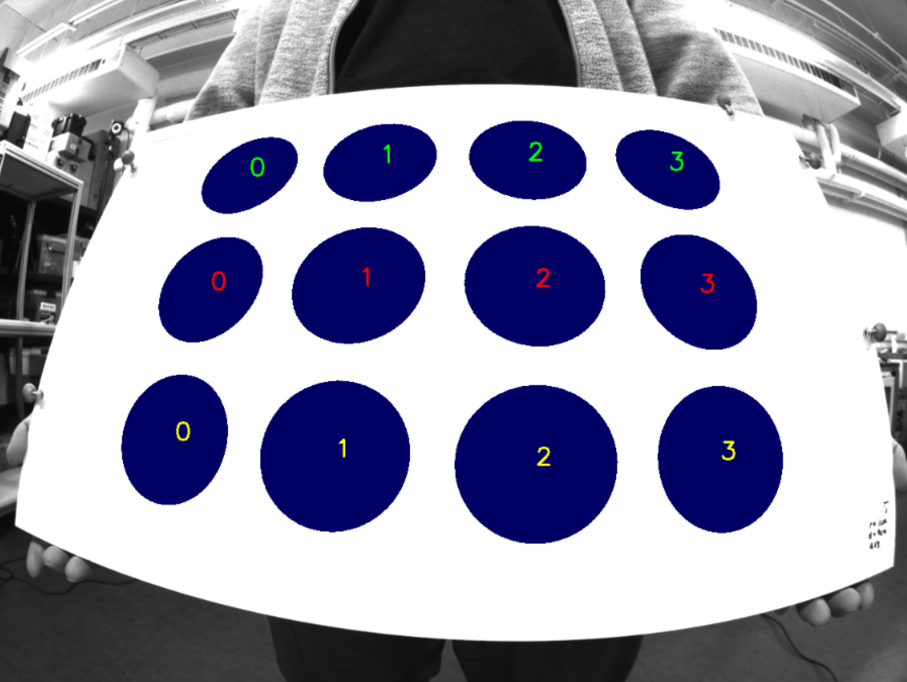

# Unbiased Estimator for Distorted Conics in Camera Calibration (CVPR24)
## Description

As shown above, the circle center is not projected to the centroid of the distorted ellipse under perspective transformation and distortion. Without considering geometery of the distorted ellipse, existing circular pattern-based calibration methods are biased, which leads low calibration accuracy than a checkerboard pattern. 

**Our unbiased estimator completes the missing piece in the conic-based calibration pipeline and outperforms the checkerboard pattern-based calibration.**

## Camera model
We assume pin-hole camera model with radial distortion.

Calibration results:	
	fx, fy, cx, cy, skew, d1, d2, ... dn

# How to use
## Dependency
- [Ceres-Solver](http://ceres-solver.org/index.html)
- [Eigen3](https://eigen.tuxfamily.org/dox/index.html)
- opencv4

We also furnish official docker image.

	docker pull chaehyeonsong/discocal:latest

## How to run
	## Build
	cd [your path]/discocal
	mkdir build
	cd build
	cmake ..
	make

	## Run
	./main.out [n_x] [n_y] [n_d] [img_dir_path] [r(m)] [distance(m)] [0:rgb, 1:thermal]

## Important
**To get high-quality results, plz check all pixels in the circle are correctly detected like this.**
<!-- {: width="100" height="100"} -->

If you don’t want to verify the images, turn off the “check_detection_results” option in "main.cpp".

Our circle detector finds the elliptical blobs in the image with the color value and ellipse test.

#### Parameters:
- **color_threshold_max**: the intensity threshold between the blob and surrounding pixels (intensity of a blob pixel < color_threshold_max)
- **size_threshold**: the number of pixels composing a blob is bigger than this value
- **fullfill_threshold**: the difference between real area and estimated area resulting from ellipse fitting
- **eccentricity_threshold**: the length ratio between a blob's major and minor axis.
You can refine these parameters in the TargetDetector class.

# Bibtex
	@INPROCEEDINGS { chsong-2024-cvpr,
		AUTHOR = { Chaehyeon Song and Jaeho Shin and Myung-Hwan Jeon and Jongwoo Lim and Ayoung Kim },
		TITLE = { Unbiased Estimator for Distorted Conic in Camera Calibration },
		BOOKTITLE = { IEEE/CVF Conference on Computer Vision and Pattern Recognition (CVPR) },
		YEAR = { 2024 },
		MONTH = { June. },
		ADDRESS = { Seattle },
	}