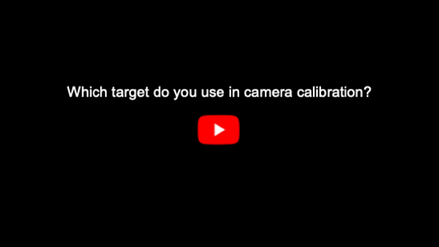

# Unbiased Estimator for Distorted Conics in Camera Calibration (CVPR24, ***highlight***)

For decades, the checkerboard pattern has been the go-to method for camera calibration, providing only pixel-level precision. But what if we could improve accuracy even further? This paper reveals the power of the circular pattern: a game-changer offering subpixel precision to meet challenges even from unconventional visual sensors.


[[Paper]](https://arxiv.org/abs/2403.04583)[[BibTex]](#bibtex)

[](http://www.youtube.com/watch?v=87_R7Qkpczo "Click to play on Youtube.com")

## News
<!-- :round_pushpin: :Patch notes,    :tada:: awards -->
- 24.04.17. :round_pushpin:We update circular pattern detector! Now, you don't need to tune hyperparameters for detections
- 24.04.05. :tada: Discocal is selected for highlight poster. (11.9% of accepted papers, 2.8% of total submissions.)

## The core limitation for conic in camera calibration

Sub-pixel accuracy and detection robustness are virtues of the conic features. But why do we use a checkerboard, not a circular pattern?

> :cry: Conic is ***not*** conic anymore under distortion!!

As shown below, the circle center is not projected to the centroid of the distorted ellipse under perspective transformation and distortion.


Without considering geometery of the distorted ellipse, existing circular pattern-based calibration methods are biased, which leads low calibration accuracy than a checkerboard pattern.

> :pushpin: **Our unbiased estimator completes the missing piece in the conic-based calibration pipeline**


# How to use
## Projection model

We assume pinhole camera model with radial distortion.
```math
\begin{aligned}
s\begin{bmatrix}
x_n\\ y_n \\ 1
\end{bmatrix} &= \begin{bmatrix} \boldsymbol{r}_1 & \boldsymbol{r}_2 & \boldsymbol{r}_3 & \boldsymbol{t} 
\end{bmatrix}\begin{bmatrix}
x_w\\ y_w \\ z_w \\ 1
\end{bmatrix} \\
k &= 1+ \sum_{i=1}^{n_d}d_i(x_n^2+y_n^2)^i \hspace{4mm}\text{(distortion model)}\\
\begin{bmatrix}
u\\ v
\end{bmatrix} &= \begin{bmatrix}
f_x & \eta & c_x \\
0 & f_y & c_y
\end{bmatrix} \begin{bmatrix}
kx_n \\ ky_n \\ 1
\end{bmatrix}
\end{aligned} 
```
Calibration results: $f_x, f_y, c_x, c_y, \eta, d_1, d_2, ... d_n$

## Dependency
- [Ceres-Solver](http://ceres-solver.org/index.html)
- [Eigen3](https://eigen.tuxfamily.org/dox/index.html)
- opencv4

(Recommend) Build a docker image using the dockerfile.

	docker build -t chaehyeonsong/discocal .  -f dockerfile

(Only for Ubuntu) or use official docker image. 

	docker pull chaehyeonsong/discocal:latest

## Bulid and Run
	## Build
	cd [your path]/discocal
	mkdir build
	cd build
	cmake ..
	make

	## Run
	./main.out [n_x] [n_y] [n_d] [img_dir_path] [radius(m)] [circle distance(m)]
	(ex) ./main.out 4 3 3 ../imgs/ 0.035 0.09

## :open_mouth: Caution: Check detection results!
**To get high-quality results, plz check all pixels in the circle are correctly detected like this.**
<!-- {: width="100" height="100"} -->


If you don’t want to check images, turn off the “check_detection_results” option in "main.cpp".


**Parameters(for experts)**:
- **fullfill_threshold**: the difference between real area and estimated area resulting from ellipse fitting
- **eccentricity_threshold**: the length ratio between a blob's major and minor axis.
You can refine these parameters in the TargetDetector class.

## Application: Thermal Camera calibration

We can leverage the detection robustness of the circular patterns, particularly for unconventional cameras, such as thermal cameras.


## BibTex
```
@INPROCEEDINGS{chsong-2024-cvpr,  
    AUTHOR = { Chaehyeon Song and Jaeho Shin and Myung-Hwan Jeon and Jongwoo Lim and Ayoung Kim },  
    TITLE = { Unbiased Estimator for Distorted Conic in Camera Calibration },  
    BOOKTITLE = { IEEE/CVF Conference on Computer Vision and Pattern Recognition (CVPR) },  
    YEAR = { 2024 },  
    MONTH = { June. },  
    ADDRESS = { Seattle },  
}
```
