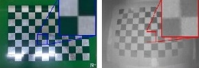
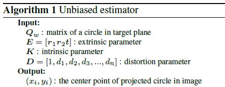

# 논문의 한글 버전 정리

## 논문의 핵심 아이디어

카메라 캘리브레이션 과정에서 가장 많이 쓰는 타겟 패턴은 사각형 모양이 반복되는 checkerboard 패턴일 것입니다. 이 사각형 모양의 패턴은 사각형들이 만나는 교점을 추출하고 이 점들을 활용해서 카메라의 intrinsic parameter 값들을 구하게 됩니다. 그런데 생각해보면 아래와 같은 예시에서 이미지에 blur 가 있거나 수중에서 취득된 이미지이거나 열화상 카메라와 같은 특수 상황에서는 코너점을 정확하게 추출하는 것이 어렵습니다. 픽셀을 확대해서 보면 아래와 같이 뭉개지는데 여기에서 정확한 교차점을 알아내는 것 자체가 어렵겠죠. 이미지 픽셀 좌표는 정수화되어 있기 때문에 sub-pixel 정확도를 얻기는 힘듭니다.

그래서 알려진 또 다른 패턴은 원형 패턴을 사용하는 것입니다. 원형패턴을 사용하게 되면 detection 측면에서 여러가지 장점이 있습니다.

* Sub-pixel accuracy로 측정이 가능하다. 10,000개가 넘는 픽셀이 검정 영역의 중심을 결정하기 때문에 매우 정확한 좌표를 얻을 수 있습니다.
* 노이즈가 심한 이미지에서 사각형의 코너를 구하는 것 보다 robust 합니다.

이런 원형 패턴을 수학적으로 다루기 위해서 우리는 conic 이라는 수학적 표현방법을 사용합니다. Conic은 원뿔곡선으로 해석되는데, 우리가 알고 있는 2차 곡선의 방정식(conic section)을 생각하면 됩니다. 

그러면 이렇게 detection 측면에서도 좋은 장점이 있고 수학적 모델도 존재하는 원형 패턴을 두고, 사람들은 사각형 패턴을 쓰는 것일까요?

> 이미지 distortion이 생기면 코닉(Conic)읜 고유의 특성을 모두 잃어버리기 때문!

Detection에서는 여러가지 장점을 가지지만 왜곡이 발생하는 상황에서는 conic이 더이상 conic이 아니게 되면서 문제가 발생합니다. 위의 그림에서 보면 왜곡이 발생한 후의 원형 패턴은 완두콩 처럼 찌그러져서 더이상 이차 곡선으로 정의할 수가 없는 모양이 됩니다. 우리는 찌그러진 후에도 중심점을 구할 수 있어야 하는데 왜곡에 의해 타원이 정의가 되지 않으면 여기에서 중심점을 찾는일은 매우 어려워집니다.

기존 방법은 numerical 한 방법이나 근사를 통해서 이를 해결하려고 하다보니 중심이 어디로 projection 되었는지 구하는 과정에 bias가 발생하게 되고 당연히 bias 가 있는 추정값은 정확도가 떨어질 수 밖에 없습니다. 애써 얻은 sub-pixel accuracy가 biased estimator 때문에 아무 소용이 없게 되는 것이죠.

### 논문 한줄 요약

만약 우리가 conic에 대해서 bias가 없는 estimator를 만들 수 있다면 어떨까요? 다시 말해 왜곡이 있어도 왜곡이 생긴 완두콩 형태의 중심점을 구할 수 있는 방법을 안다면 어떨까요? 그렇다면 우리는 원형패턴을 안 쓸 이유가 없겠죠? 이 논문은 moment라는 수학적 개념을 도입해서 왜곡하에서 conic의 중심점을 tracking 할 수 있는 unbiased estimator를 만듭니다. 핵심은 다음과 같습니다.

> Moment를 이용해 conic을 표현하면 비선형 변환을 선형 변환의 형태로 다룰수 있다.

논문의 알고리즘을 간단히 in/out 만 가지고 살펴보면, 우리가 만든 unbiased estimator는 알고 있는 캘판에서의 값 (Qw)에 Extrinsic (E), Instrinsic (K), distortion parameter (D)을 적용해서 왜곡된 타원의 중심값 (x,y)를 알아내는 함수입니다. 이 값을 analytic하게 구할 수 있으며, 이를 이용해서 최적화를 통해 카메라 파라미터를 추정하게 됩니다.

논문의 내용은 이 unbiased estimator를 moment를 이용해서 구현하는 과정을 단계별로 설명한 것입니다. 요약하면 다음의 1번부터 18번까지의 과정이며, 논문의 구성은 각 과정을 풀이하고 있습니다.

## Camera Projection Model
### TODO
<!-- 
이미지가 투영되는 과정을 단계별로 나누어서 살펴봅시다.

 -->