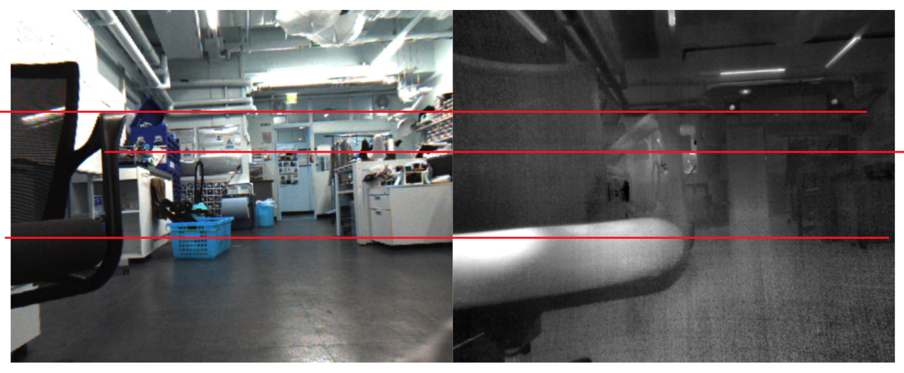

# Applications

## TIR Camera Calibration

The circular pattern offers strong detection robustness, making it especially effective for unconventional cameras such as **thermal infrared (TIR) cameras**.  
Watch the video to see it in action:

---

<!-- ## TIR��밨GB Extrinsic Calibration

Below is the result of **stereo rectification** using RGB and TIR images.  
Both intrinsic and extrinsic calibration were performed with **DiscoCal**.  
As shown, the **epipolar lines** are perfectly aligned ��� despite the differences in sensor modalities.

 -->

<!-- --- -->

## Underwater Environment

DiscoCal also works in challenging environments such as **underwater settings**.  
Check out the video demonstration:

---
<!-- ## RGB Stereo -->

## RGB-LiDAR Extrinsic Calibration

DiscoCal is also compatible with LiDAR sensors. All you need is a planar calibration board with circular holes to get started. For detailed instructions and theoretical background, refer to the [LiDAR calibration](./LiDAR_cal.html) section.

