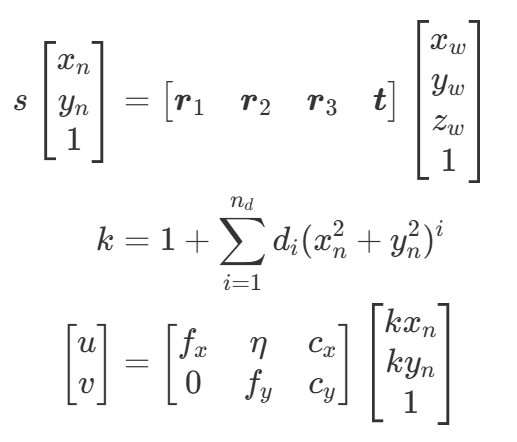
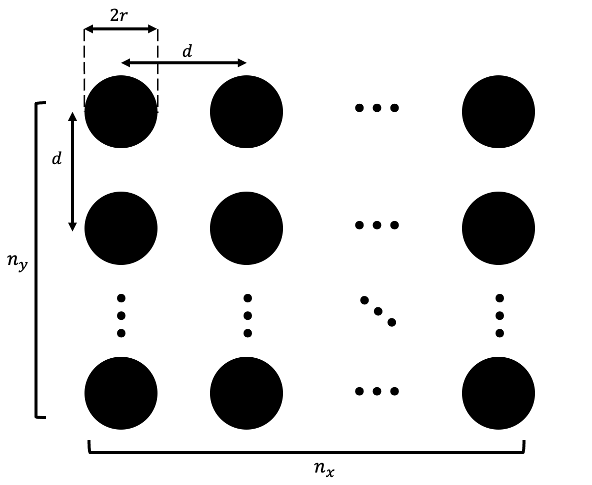
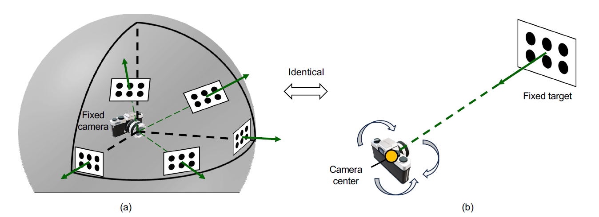

# Guidance
This section is the summerized version of our paper. For more details, please refer to our [journal](https://arxiv.org/abs/2506.16842)

## Pinhole camera model
DiscoCal assumes **Pinhole Camera Model** with **Radial Distortion**.  
A 3D point $$(x_w, y_w, z_w)$$ is projected to the image pixel $$(u,v)$$ as



$$d_i$$ is the distortion parameter and $$n_d$$ is the maximum distortion order.

The calibration result is $$f_x, f_y, c_x, c_y, \eta, d_1, d_2, ... d_n$$

### Q. How do you undisort images using this model?
#### Option 1) Use cv::undistort function (Only $$n_d \le $$3)
Our model is compatible to OpenCV pin-hole camera model. **Set p1 and p2 as zero**.

```cpp
distcoeff=(cv::Mat1d(1, 5) << d_1, d_2, 0., 0., d_3);
cv::initUndistortRectifyMap(camera_matrix, distcoeff, cv::Mat(), camera_matrix, imageSize, CV_32FC1, mapx, mapy);
cv::remap(image,undist_image, mapx, mapy, cv::INTER_LINEAR);
```
#### Option 2) Use Imagehandler class (General case)
We provide a class that has an "undistort" function. This class can deal with n_d>3 cases. Please refer to the “CImagehander.cpp” files for details.

```cpp
Imagehandler imagehandler(width, height, total_params, n_d);
cv::Mat undist_image = imagehandler.undist(image);
```

---
## Target design


Our method needs a planer white board on which black circle grid patterns are printed. 
You can easily design these patterns in this [site](https://calib.io/pages/camera-calibration-pattern-generator).

**Previous methods prefer to reduce the size of the circles to minimize bias, but our method is not limited to this. In fact, the larger the circles, the more accurate the measurements.**

> **Q. How to decide the number of cicles and the radius size?** 
The larger the radius of the circle, the more accurate the observations become. The greater the number of circles, the more observations you have, leading to increased robustness. Since these two values are in a trade-off relationship within a limited area, adjust them appropriately. It is recommended that every circle contains more than 400 pixels in images and not to exceed 7x5 circles.

---

## Optimal image sets

The images used for calibration play a critical role in determining the overall calibration performance.
To obtain optimal images, we recommand that the 6D configuration between the target board and the camera should satisfy one of following conditions:

- Case a (When the camera is fixed) : 
Imagine a virtual sphere centered at the camera. Capture images by positioning the target board tangentially to the sphere, covering a wide range of angles.


- Case b (When the target is fixed) :
In this case, place the camera such that its optical center faces the target directly, and capture images by applying pure rotational motion to the camera.



Those two methods completely identical from the perspective of the relative configuration between the camera and the target.

