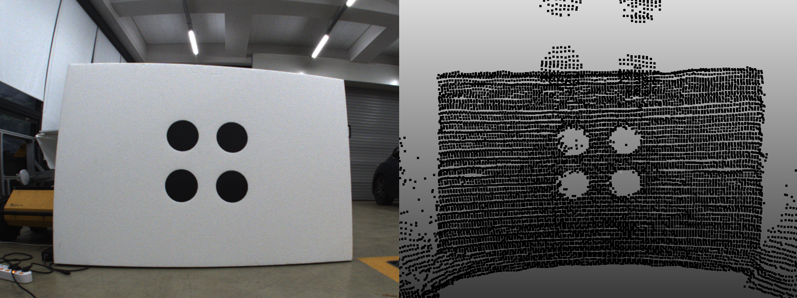
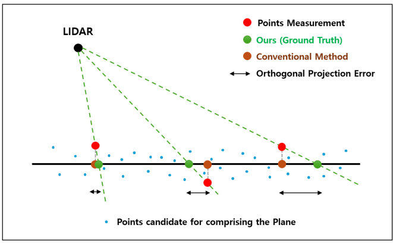
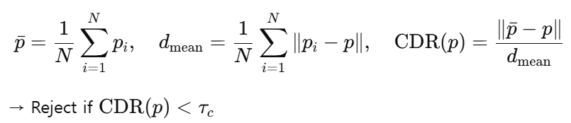
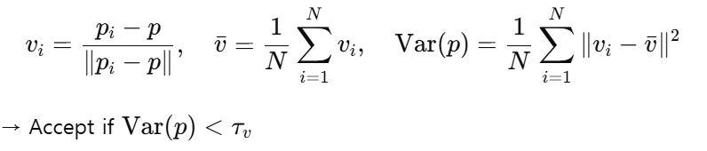
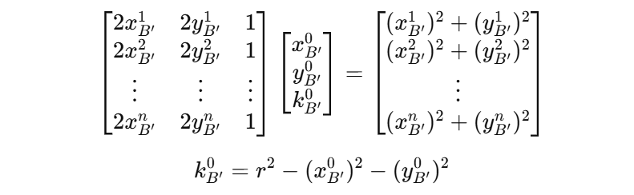
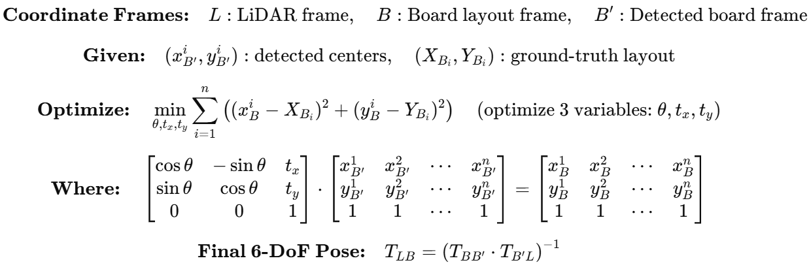

# LiDAR_cal

This section consists of two main parts: **instructions for running the calibration**, and the **theoretical background** behind the algorithm. For further details, refer to the following [paper](https://koreascience.kr/article/JAKO202516432402590.page).

## How to Run

### 0. Calibration Requirements

A single **calibration board with circular patterns** is required, and it must satisfy the following two conditions:

1. **Punched-through Circles**  
   The circles must be **physically punched through** so that the LiDAR can capture a point cloud with visible circular holes.  
   To enhance contrast in RGB images, place a **black plate behind the board** so the holes appear dark in the image.

2. **Minimum Circle Spacing**  
   The **distance between adjacent circle centers** is recommended to be **greater than three times the circle radius** to ensure robust detection and minimize clustering ambiguity.

### 1. Data Collection

Prepare **multiple pairs** of:

- RGB **images**: `.png` format  
- LiDAR **point clouds**: `.pcd` format (**required**)

Capture the board from a variety of positions and angles to maximize calibration robustness.  
DiscoCal is designed to work reliably even when the board appears at arbitrary poses.

If your LiDAR captures are stored in `.ply` format, you can convert them into `.pcd` format using the following command:

```bash
python convert_ply_into_pcd.py ./INPUT_DIR ./OUTPUT_DIR
```



### 2. Modify the config file

- [`lidar.yaml`](../codes/lidar.yaml) : This is a config template of LiDAR-camera calibration. You can adjust some parameters for more reliable data processing.

 Key Parameters in lidar.yaml are as below

#### 1) coarse boundary
	coarse_bd_x1: 0.0 #for coarse boundary detection
    coarse_bd_x2: 5.0
    coarse_bd_y1: -2.0
    coarse_bd_y2: 2.0
    coarse_bd_z1: -0.5
    coarse_bd_z2: 3.0
 Tip 1: Adjust `coarse_bd_z1` to exclude ground points. This helps better distinguish the circular board from its surroundings.

 Tip 2: Adjust other parameters to eliminate planar surfaces that resemble the circular board. These similar planes may interfere with accurate board detection.

#### 2) board detection parameter
	eps : 0.05  # for clustering
Tip 1: If the distance between points on the board exceeds 'eps' (in meters), clustering may fail. Adjust this parameter appropriately for accurate detection. Use visualization mode to assist with tuning and debugging.

#### 3) plane threshold
	distance_threshold: 0.02 #for plane fitting , plane width/2
After detecting the board, this parameter determines the allowable distance from the plane. when projecting points onto it. Adjust to control how tightly points must fit the detected plane.

#### 4) cdr & direction variance
	cdr: 0.4  # For boundary detection - decreasing this value increases the number of boundaries detected
    direction_var: 1.0  # For boundary detection - increasing this value increases the number of boundaries detected
 Tune these parameters based on the visualized boundary point results for optimal detection.

### 3. Run

This section illustrates how to manually build and run the Docker container for LiDAR calibration.  
For a simpler setup using Docker Compose, refer to the [Quick Installation Guide](https://github.com/chaehyeonsong/discocal).

1) Build with Docker
```bash
git clone https://github.com/chaehyeonsong/discocal.git
cd discocal
docker build -t discocal-lidar .
```
After build, runfiles will be created in discocal folder 

2) Run the Container (with GUI support) 

To allow Docker containers to access your X server, run this in your terminal on the host machine (not inside Docker):
```bash
xhost +local:root
```
After, run Docker with X11 forwarding enabled, This command starts the container with GUI access:
```bash
sudo docker run -it --rm \
    -e DISPLAY=$DISPLAY \
    -v /tmp/.X11-unix:/tmp/.X11-unix \
    -v "$(pwd)":/app \
    -w /app \
    discocal-lidar
```
Inside the Docker container, build and run the program:
```bash
mkdir build
cd build
cmake ..
make
LIBGL_ALWAYS_SOFTWARE=1 ./lidar.out
```

## Algorithm
The overall process consists of four main stages:

### 1. Board Detection
To localize the calibration board in the LiDAR point cloud, we apply a combination of segmentation and geometric constraints:
- **plane segmentation**:
A RANSAC-based plane fitting is applied to extract the dominant planar surface. Among the candidate planes, we select the most planar and appropriately sized one using PCA analysis and some proper filterings.
- **perspective projection**:
The points on the detected board are perspectively projected onto the fitted plane. Perspective projection can **remove range error**, thus
**accurate circular patterns can be obtained**.



### 2. Circle Detection
We introduce a robust filtering-based detection approach that does **not rely on the ring channel**, enabling wider LiDAR compatibility:
- **Centroid Distance Ratio(CDR)**:
Given a point p and its neighbors p_i, the Centroid Distance Ratio is defined as:


- **Directional Variance**:
Using the same notation, the directional variance of normalized neighbor vectors is computed as:


Points that satisfy these conditions are extracted as boundary points.

### 3. Center Detection
After boundary extraction and projection, circle centers are estimated through:
- **Clustering**:
Boundary points are spatially grouped into clusters, each representing one circle.
- **Circle Fitting**:
For each cluster, the `ransacCircleFit()` function selects the best inlier set, which is then refined using a least-squares 2D fitting (`circleFitConstrained2D()`).
The center of each circle is computed by solving the following linear system:


### 4. 6-DoF Estimation
Using the sorted 3D circle centers and the known board layout, we estimate the 6-DoF pose of the calibration board with respect to the LiDAR frame as follows:

- **2D rigid transformation** (rotation + translation) is optimized to align the detected circle centers with the board layout in 2D space.

- This alignment is formulated as a least-squares problem and solved using **Ceres Solver** to obtain the optimal rotation and translation.

- The resulting 2D transform is lifted to 3D using the known board plane, and combined with the plane-to-LiDAR transform to compute the final **6-DoF pose** of the board in the LiDAR frame.

