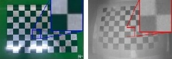
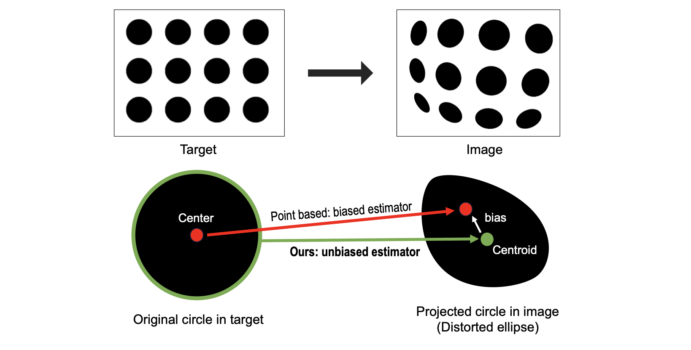
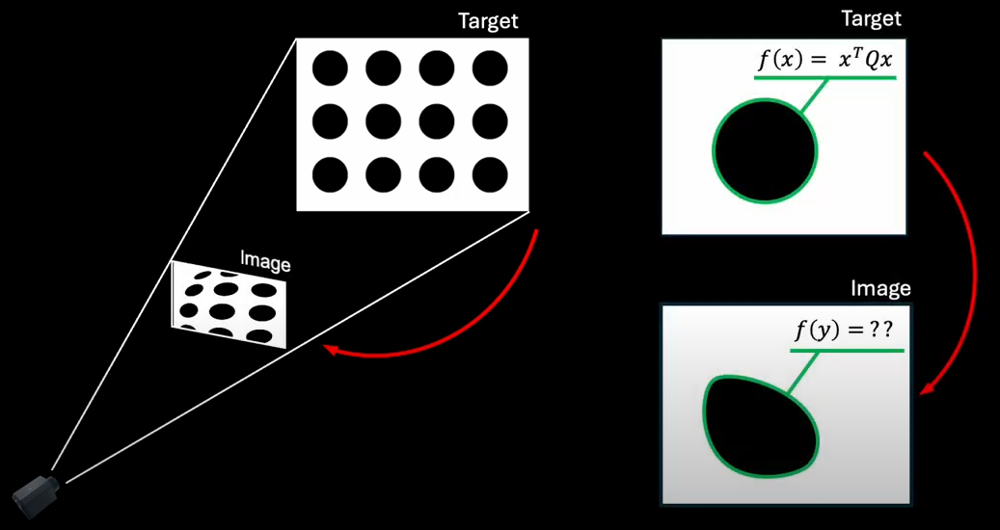
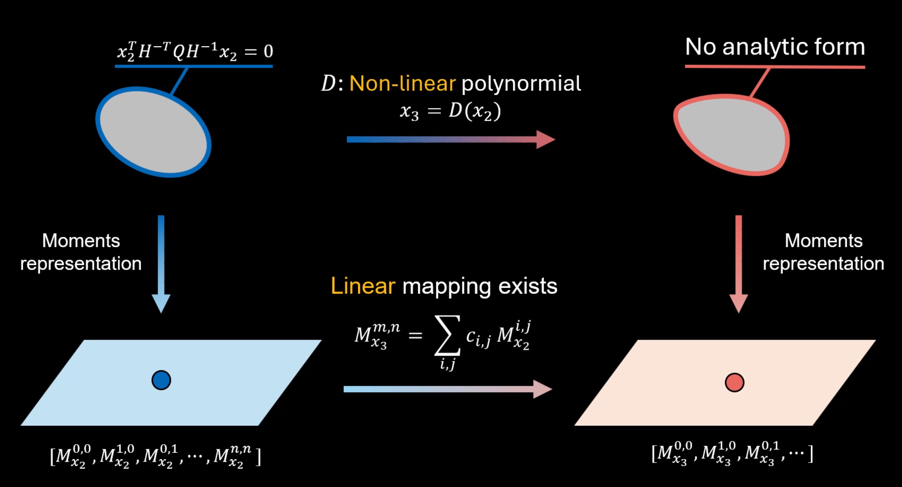
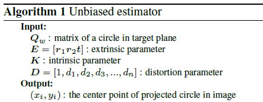
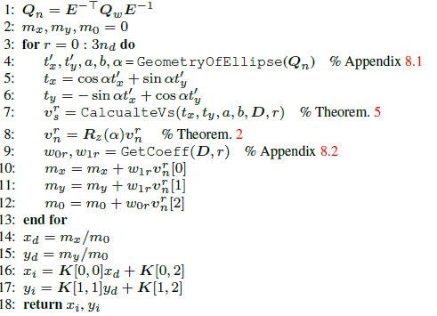
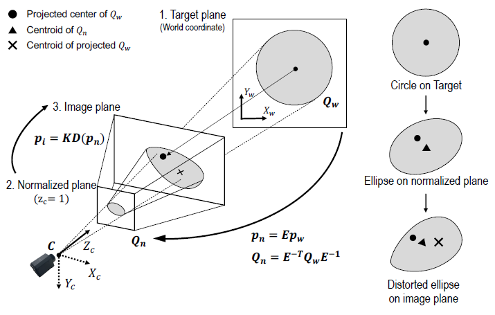

# Korean version

## Circular Pattern의 장점

카메라 캘리브레이션 과정에서 가장 많이 쓰는 타겟 패턴은 사각형 모양이 반복되는 checkerboard 패턴일 것입니다. 이 사각형 모양의 패턴은 사각형들이 만나는 교점을 추출하고 이 점들을 활용해서 카메라의 intrinsic parameter 값들을 구하게 됩니다. 그런데 생각해보면 아래와 같은 예시에서 이미지에 blur 가 있거나 수중에서 취득된 이미지이거나 열화상 카메라와 같은 특수 상황에서는 코너점을 정확하게 추출하는 것이 어렵습니다. 픽셀을 확대해서 보면 아래와 같이 뭉개지는데 여기에서 정확한 교차점을 알아내는 것 자체가 어렵겠죠. 이미지 픽셀 좌표는 정수화되어 있기 때문에 sub-pixel 정확도를 얻기는 힘듭니다.

그래서 알려진 또 다른 패턴은 원형 패턴을 사용하는 것입니다. 원형패턴을 사용하게 되면 detection 측면에서 여러가지 장점이 있습니다.

* Sub-pixel accuracy로 측정이 가능하다. 10,000개가 넘는 픽셀이 검정 영역의 중심을 결정하기 때문에 매우 정확한 좌표를 얻을 수 있습니다.
* 노이즈가 심한 이미지에서 사각형의 코너를 구하는 것 보다 robust 합니다.

## Distortion에 취약한 Circular Pattern

그러면 이렇게 detection 측면에서도 좋은 장점이 있고 수학적 모델도 존재하는 원형 패턴을 두고, 사람들은 사각형 패턴을 쓰는 것일까요? 일단 calibration을 하기위해서는 3차원 상의 어떤 **control point** (예: 교차점)가 projective projection과 lens distortion을 거쳐서 어디로 투영되는지 알아야 합니다. 쉬운 설명을 위해서 control point를 기존에 많이 쓰는 체커보드의 교차점으로 놓고 설명을 해보겠습니다.

체커보드의 경우 3차원에상의 검은색과 흰색교차점을 control point라고 보면, 이 한 점이 이미지상의 한점으로 mapping 되는 투영은 우리가 구하고자 하는 intrinsic parameter들과 distortion parameter 들의 함수로 나타나게 됩니다.

> x_proj = fcns (cx,cy,fx,fy,k1,...,k5): 식에 의해 계산

Calibration 과정 우리는 여러장의 이미지를 얻게 됩니다. N장의 이미지를 얻었을 때 각 이미지에서 우리는 교차점을 쉽게 구할 수 있습니다. 이렇게 실제 이미지에서 얻은 교차점을 measured point라고 하겠습니다.

> x_meas: 실제 취득한 image에서 영상처리를 통해 취득

이렇게 모델을 통해서 구해지는 값과 실제 calibration 위해 취득한 이미지에서의 점을 비교해서 둘의 차이를 최소하 하는 최적화 문제를 풀면 우리는 intrinsic parameter와 distortion parameter를 알 수 있습니다.

원형 패턴의 경우 어느 부분이 어려운 것일까요? 가장 큰 문제는 control point의 추정값인 x_proj을 구하는 것이 쉽지 않다는 점입니다. 원형패턴에서 관측값인 x_meas는 이미지 상에서 관측되는 패턴의 면적 중심(centroid) 입니다. 하지만 **이미지의 centroid는 초기 원형 패턴의 중심점과 대응되지 않습니다.** 만약 원의 중심점을 이미지로 projection 시키면 아래 그림에서 빨간색으로 나타나는 점이 됩니다. 면적 중심인 centroid와 차이가 있는것을 알 수 있습니다.

기존 방법은 numerical 한 방법이나 근사를 통해서 이를 해결하려고 하다보니 중심이 어디로 projection 되었는지 구하는 과정에 bias가 발생하게 되고 당연히 bias 가 있는 추정값은 정확도가 떨어질 수 밖에 없습니다. 애써 얻은 sub-pixel accuracy가 biased estimator 때문에 아무 소용이 없게 되는 것이죠.

**이러한 문제를 해결하려면 원형 패턴의 경우 점이 아닌 도형자체가 어떻게 projection 되는지 구해야 합니다.**

원형 패턴을 수학적으로 다루기 위해서 우리는 conic 이라는 수학적 표현방법을 사용합니다. Conic은 원뿔곡선으로 해석되는데, 우리가 알고 있는 2차 곡선의 방정식(conic section)을 생각하면 됩니다. 3차원의 원형 패턴은 아래 그림처럼 투영되면서 왜곡도 함께 적용됩니다. 하단 오른쪽 그림에서 원래 2차함수로 잘 표현되던 도형이지만, 왜곡이 적용되고 난 후의 변형된 도형은 더 이상 2차곡선 형태가 아닌것을 알 수 있습니다.. 왜곡이 발생하는 상황에서는 conic이 더이상 conic이 아니게 되면서, 원형 패턴이 완두콩 처럼 찌그러져서 더이상 수학적으로 정의할 수가 없는 모양이 됩니다. (conic의 경우 선형 변환에 대해서만 성질이 보존되며 이미지의 distortion의 경우 n차 다항식으로 이루어진 비선형 변환입니다.)

> 이미지 distortion이 생기면 코닉(Conic)의 고유의 특성을 모두 잃어버림!

이러한 한계로 인해서 **원형을 함수형태로 calibration에서 활용하는 것은 distortion이 없는 경우에만 주로 연구**가 되었으며 왜곡이 발생하게 되면 식을 통한 접근 방식에는 한계가 있습니다.

## DISCO CAL: Unbiased estimator for distorted conic

만약 우리가 conic에 대해서 bias가 없는 estimator를 만들 수 있다면 어떨까요? 다시 말해 왜곡이 있어도 왜곡이 생긴 완두콩 형태의 중심점을 정확히 구할 수 있는 방법을 안다면 어떨까요? 그렇다면 우리는 원형패턴을 안 쓸 이유가 없겠죠? 이 논문은 moment라는 수학적 개념을 도입해서 왜곡하에서 conic의 중심점을 tracking 할 수 있는 unbiased estimator를 만듭니다. 핵심은 다음과 같습니다.

> Moment를 이용해 conic을 표현하면 비선형 변환을 선형 변환의 형태로 다룰수 있다.

위에서 본 경우에서 처럼 2차함수의 식으로 예쁘게 표현하는 것은 왜곡에 의해 모양이 찌그러지고 나면 더이상 불가능합니다. 하지만 형태를 2차함수의 꼴로 나타낼 수 없다하더라도 moment로 conic을 표현하는 것은 언제나 가능하며 심지어 왜곡하에서도 moment가 어떻게 변형될지 계산할 수 있습니다. 이 논문의 핵심 아이디어는 conic을 2차함수가 아닌 moment로 나타내자는 것이고, 그렇게 되면 투영과 왜곡하에서도 계속 moment가 어떻게 변형되어 가는지 tracking할 수 있습니다. 그리고 그 중에서 1차 moment인 centroid 값을 이용해서 측정된 (`x_meas`)과 비교하여 최적화 문제를 풀고 calibration을 합니다.

논문의 알고리즘을 간단히 in/out 만 가지고 살펴보면, 우리가 만든 unbiased estimator는 알고 있는 캘판에서의 값 (Qw)에 Extrinsic (E), Instrinsic (K), distortion parameter (D)을 적용해서 왜곡된 타원의 중심값 (x,y)를 알아내는 함수입니다. 이 값을 analytic하게 구할 수 있으며, 이를 이용해서 최적화를 통해 카메라 파라미터를 추정하게 됩니다.

논문의 내용은 이 unbiased estimator를 moment를 이용해서 구현하는 과정을 단계별로 설명한 것입니다. 요약하면 다음의 1번부터 18번까지의 과정이며, 논문의 구성은 각 과정을 풀이하고 있습니다.

<!--
## Camera Projection Model
### TODO

이미지가 투영되는 과정을 단계별로 나누어서 살펴봅시다.

 -->
