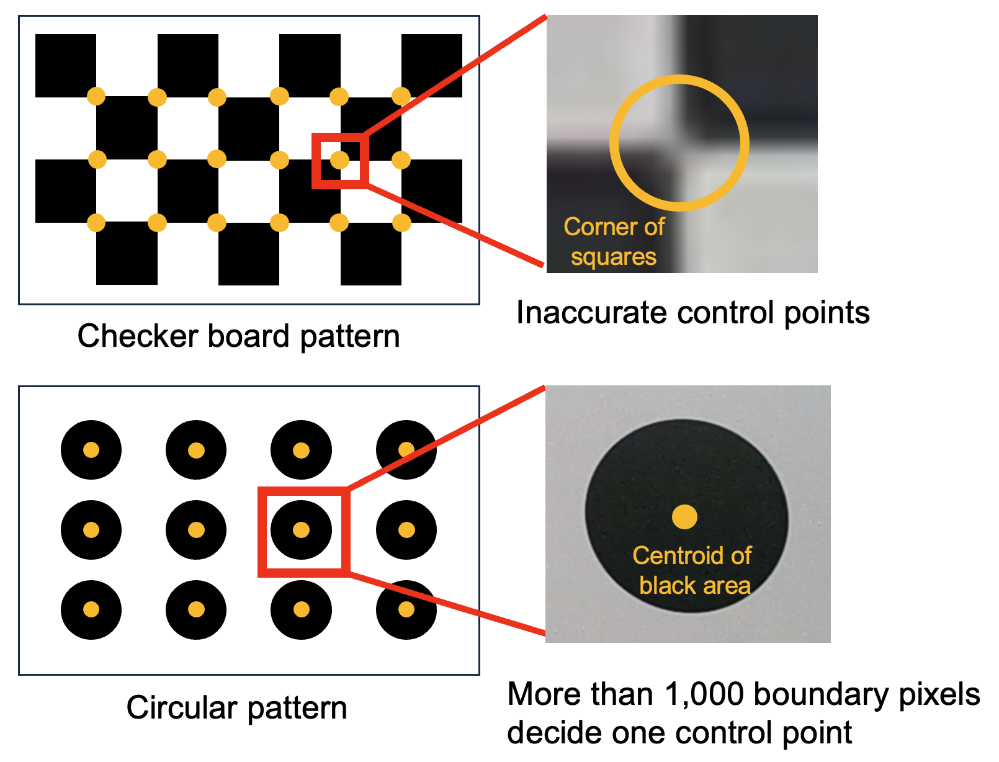
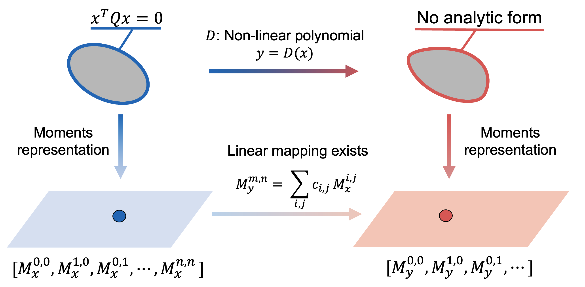
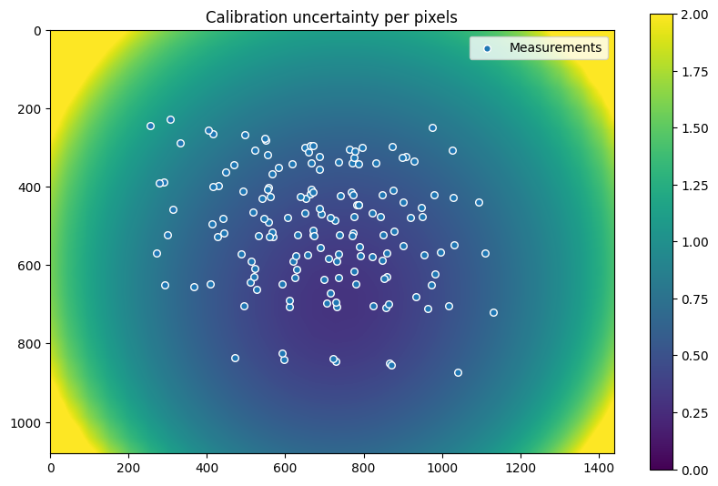

# Why DiscoCal?

For decades, the checkerboard pattern has been regarded as the standard method for camera calibration, offering only **pixel-level precision**. But what if we could push the limits of accuracy even further?  
**DiscoCal** reveals the power of the **circular pattern** — a game-changer that enables **subpixel precision**, even for challenging sensors such as thermal or cameras with high-distortions.

## Advantages of the Circular Pattern

The checkerboard pattern uses the corners of squares as control points.  
However, these corners are only accurate to the **pixel level**, as shown below:

In contrast, the circular pattern uses the **centroids of circular shapes**, which can be detected with **subpixel accuracy**.

## Unbiased Projection Model

Subpixel accuracy and detection robustness are key strengths of [conics](https://en.wikipedia.org/wiki/Conic_section) features.  
So why has the checkerboard remained dominant over the circular pattern?

> 😢 **Conics are no longer true conics under lens distortion!**

As shown below, due to perspective and lens distortion, the **projected center of a circle** no longer coincides with the **centroid of the resulting ellipse**.

Most calibration methods using circualr patterns **ignore the geometry of the distorted ellipse**, leading to **bias** and lower calibration accuracy than checkerboard methods.

> 📌 **Our unbiased estimator fills the missing piece in conic-based calibration.**

[This paper](https://arxiv.org/abs/2403.04583) introduces an **unbiased projection model** for circular patterns using a probabilistic concept called [moments](https://en.wikipedia.org/wiki/Moment_(mathematics)).  
Although there is no simple analytic form for distorted ellipses, **moment representations always exist**.

## Uncertainty-aware Framework

Even when using a circular pattern, it is impossible to obtain ideal measurements from real-world images.  
Therefore, incorporating measurement uncertainty into the calibration process enhances both overall accuracy and robustness.

DiscoCal is the first method to define and utilize the **uncertainty of circular pattern detection**.  
It provides not only the calibration parameters, but also the **standard deviation** (i.e., uncertainty) for each parameter, as shown below (when $$n_d=2$$) :

| Parameter   | fx     | fy     | cx     | cy     | skew  | d1      | d2      | d3 | d4 |
|-------------|--------|--------|--------|--------|--------|---------|---------|----|----|
| Mean        | 491.2  | 491.4  | 725.9  | 570.0  | 0.60   | -0.008  | 0.002   | 0  | 0  |
| $$2\sigma$$ | 0.94   | 0.91   | 0.30   | 0.38   | 0.104  | 0.0009  | 0.0006  | 0  | 0  |

You can also check the calibration uncertainty in image space.  
After calibration, DiscoCal generates an **uncertainty map**, which indicates the pixel-wise accuracy of the calibration.

